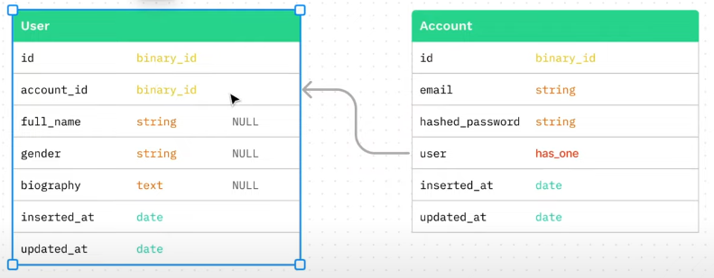

# RealDealApi

#### Elixir API: Password authentication API made with Phoenix framework

## 🚀 Features:

- [x] **JSON API for creating and authenticating user accounts:** Authentication using JWT and login using a session that stores the user ID. Esto se logra agreagando las bibliotecas [`Guardian`](https://hexdocs.pm/guardian/readme.html) y [`Guardian.DB`](https://hexdocs.pm/guardian_db/readme.html)
- [x] **JWT access and refresh tokens functionality:** which is also achieved through the aforementioned libraries. By adding JWTs to a table in the database, we can revoke the tokens at our convenience. Alternatively, Guardian.DB handles their automatic deletion by scanning the database every hour (configurable).
- [x] **Complete unit test suite for modules corresponding to the `Ecto` schemas and their corresponding `Phoenix` contexts:** Using the [`Faker`](https://hexdocs.pm/faker/readme.html) and [`ExMachina`](https://hexdocs.pm/ex_machina/readme.html) libraries, valid and invalid data factories are created for use in the tests, taking into account that an `Ecto` association exists between the application's domain entities.

## 👨‍🚀 Getting Started:

In development and testing, a `PostgreSQL` database is used, which must be provided by the user via a `Docker` container, so you must have `Docker` installed on your system. A `docker-compose.yml` file is provided that downloads the `PostgreSQL` image and creates and runs a container with it. At the same time, it generates a directory (`app_data`) outside the project folder where the data storage volume is mounted.

To start your Phoenix server:

  * Run `mix setup` to install and setup dependencies
  * Start Phoenix endpoint with `mix phx.server` or inside IEx with `iex -S mix phx.server`

Now you can visit [`localhost:4000`](http://localhost:4000) from your browser.

You can test the `RealDealAPI` endpoints in any API testing application (`Postman`, `Insomnia`, etc.)

Ready to run in production? Please [check our deployment guides](https://hexdocs.pm/phoenix/deployment.html).

## Learn more

  * Official website: https://www.phoenixframework.org/
  * Guides: https://hexdocs.pm/phoenix/overview.html
  * Docs: https://hexdocs.pm/phoenix
  * Forum: https://elixirforum.com/c/phoenix-forum
  * Source: https://github.com/phoenixframework/phoenix
